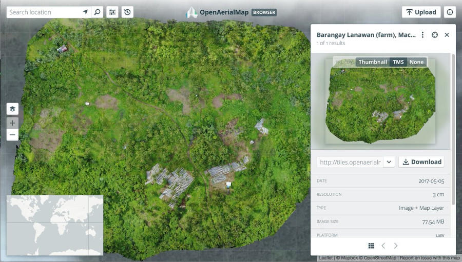

# OpenAerialMap Frontend [](https://travis-ci.org/hotosm/oam-browser) 

OpenAerialMap (OAM) is a set of tools for searching, sharing, and using openly licensed satellite and unmanned aerial vehicle (UAV) imagery. 

Built on top of the [Open Imagery Network](https://openimagerynetwork.github.io/) (OIN), OAM is an open service that provides search and access to this imagery.



## Local setup

[Create React App](https://github.com/facebookincubator/create-react-app) is used to scaffold, compile and build the project.

So you will first need recent versions of Node and Yarn on your system. Then, in the project's root, run;

```bash
yarn install
yarn start
```

You should be able to see the site in your browser at `http://localhost:3000`

However, to get all functionality you will also need to point it at a running [Catalog API](https://github.com/hotosm/oam-catalog). By default the endpoint of the staging instance of the API will be used, however you can change the endpoint to a locally running API in `src/config/local.js`.

## Deployment

This is a Single Page Application and needs only a web server to serve it. Therefore it can be hosted on S3 or just
as a folder under Nginx.

The backend API URI can be changed in `src/config.js`

To prepare the files:

`yarn build`

Then copy the `build/` folder to your web server or S3.

## Testing
2 distinct test suites exist.

**Unit-like tests**, under `test/specs`    
These should be isolated and fast, with as much mocking/stubbing as possible, suitable for TDD. Run with:    
`mocha --opts test/specs/mocha.opts test/specs` or `npm test`

**Integration tests**, under `test/integration`    
These are end-to-end, cross-browser tests, that should test as much of the stack as possible. Currently they are run on Browser Stack against various browsers. They can be run locally against a Web Driver compatible browser client like [chromedriver](https://sites.google.com/a/chromium.org/chromedriver/) or [geckodriver](https://github.com/mozilla/geckodriver). 
You will need a running [Catalog API](https://github.com/hotosm/oam-catalog), the repo has a Dockerfile to quickly get
a local version of the API running. Then you can run tests with;
`wdio test/integration/wdio.local.conf.js`.

Note that Browserstack tests both a pinned version of the API (defined in `package.json` and the latest version of the API).

Because `wdio` wraps `mocha`, you can send `mocha` args via `wdio.default.conf.js`'s `mochaOpts` field. For instance `grep` has been added so you can isolate a single test run with:    
`MOCHA_MATCH='should find imagery' wdio test/integration/wdio.local.conf.js`

## Contributing

Contributions are very welcome. Please see [CONTRIBUTING.md](./CONTRIBUTING.md).

## License
OAM Browser is licensed under **BSD 3-Clause License**, see the [LICENSE](LICENSE) file for more details.
